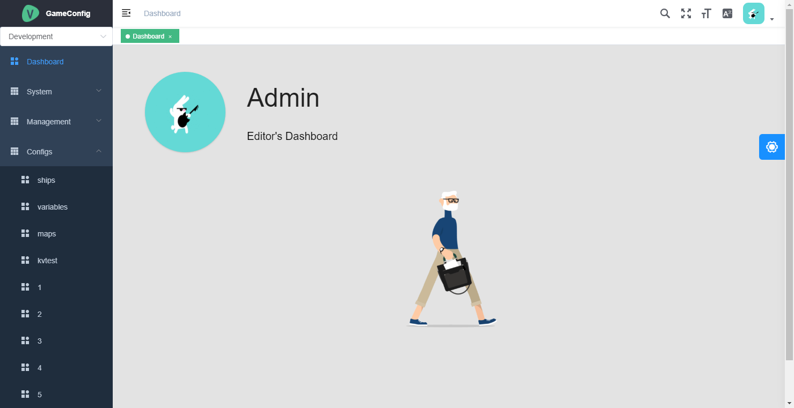
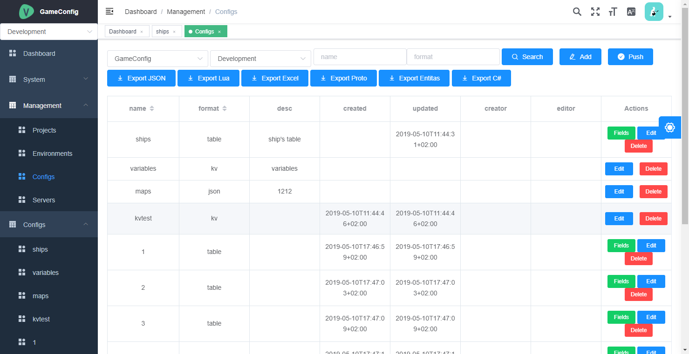
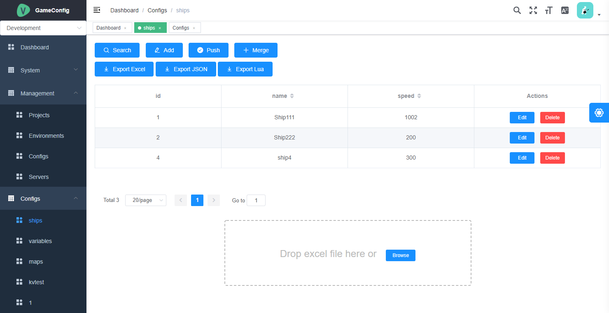

# configurator

a tool for config game data

## Tech Stack
* Server Framework: [Macaron](https://go-macaron.com/)
* Web Framework: [Vue](https://vuejs.org/)
* WebUI Template: [VueElementAdmin](https://github.com/PanJiaChen/vue-element-admin)
* Storage: [Mongo](https://www.mongodb.com/)

## Server
```
go run main.go
```

## Client
```
npm install
npm run dev
```

## Screenshot

### Index Page


## Configs


## Table Config
